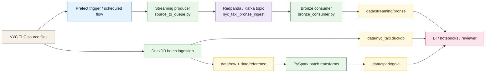

# NYC Taxi Architecture

## Streaming addition

- The new piece is the queue between source and bronze: the source is read automatically by a Prefect-triggered producer and pushed to Kafka-compatible Redpanda.
- The consumer drains queue messages into raw bronze batch files under `data/streaming/bronze`.
- The previous DuckDB and Spark layers remain in place, so the project now contains both batch and streaming patterns.
